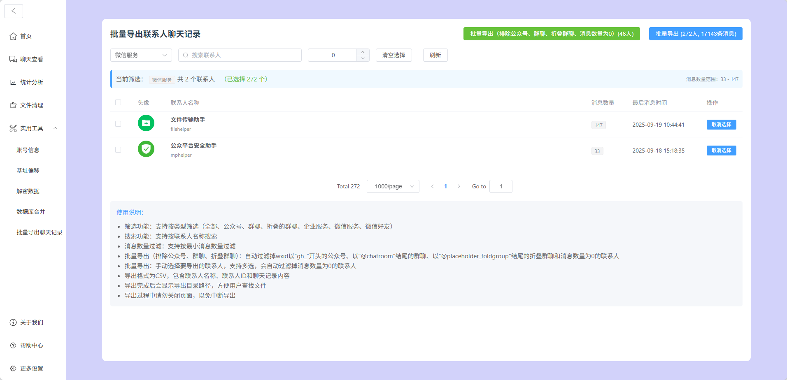

# wxdump_web - 微信聊天记录查看工具

> 🚀 **推荐使用功能更全的Plus版本：[wx-dump-plus](https://github.com/baiyajin/wx-dump-plus)**
> 
> wx-dump-plus 是基于 PyWxDump 和 wxdump_web 的整合升级版本，集成了更多功能特性，包括：
> - 🎯 完整的微信信息获取和数据库解密功能
> - 📊 更强大的数据分析和可视化功能
> - 🛠️ 更多实用工具和批量操作
> - 🚀 性能优化和界面升级
> - 📱 响应式设计和更好的用户体验
> 
> **⚠️ 重要通知：wxdump_web_batch 项目后期不再维护，建议优先使用wx-dump-plus以获得更好的体验和持续支持！**

---

一个基于 Vite + Vue 3 + TypeScript + Element Plus 的微信聊天记录查看和导出工具，支持在浏览器中查看、分析和批量导出微信聊天记录。

## ✨ 功能特性

### 🔍 聊天记录查看

- 支持查看所有联系人的聊天记录
- 支持多种消息类型：文本、图片、视频、语音、文件、表情等
- 实时消息获取
- 分页浏览，支持大量消息记录

### 📊 统计分析

- 聊天数据统计和分析
- 联系人活跃度分析
- 消息类型分布统计
- 时间热力图展示

### 🛠️ 实用工具

- **账号信息管理**：查看微信账号详细信息
- **基址偏移**：支持微信版本基址偏移配置
- **数据解密**：解密微信数据库
- **数据库合并**：合并多个微信数据库
- **批量导出聊天记录**：支持批量导出联系人聊天记录到 CSV 格式

### 📤 批量导出功能（新增）

- **智能过滤**：自动过滤公众号、群聊、文件夹分组和空消息联系人
- **批量导出（非公众号、非群聊）**：一键导出所有个人联系人聊天记录
- **手动选择导出**：支持手动选择特定联系人进行导出
- **导出路径显示**：导出完成后显示文件保存路径
- **进度显示**：实时显示导出进度和状态
- **多格式支持**：支持 CSV、JSON、HTML、PDF、DOCX 等多种导出格式

## 🚀 快速开始

### 环境要求

- Node.js >= 16.0.0
- npm >= 8.0.0

### 安装依赖

```bash
npm install
```

### 开发模式

```bash
npm run dev
```

### 构建生产版本

```bash
npm run build
```

### 预览生产版本

```bash
npm run preview
```

## 📁 项目结构

```
wxdump_web/
├── src/
│   ├── api/                    # API 接口
│   │   ├── base.ts            # 基础 API
│   │   ├── chat.ts            # 聊天相关 API
│   │   └── stat.ts            # 统计相关 API
│   ├── assets/                # 静态资源
│   │   ├── icon/              # 图标组件
│   │   └── img/               # 图片资源
│   ├── components/            # 组件
│   │   ├── chat/              # 聊天相关组件
│   │   ├── chatBackup/        # 聊天备份组件
│   │   ├── stats/             # 统计组件
│   │   └── utils/             # 工具组件
│   ├── router/                # 路由配置
│   ├── utils/                 # 工具函数
│   ├── views/                 # 页面视图
│   │   ├── tools/             # 工具页面
│   │   │   └── BatchExportView.vue  # 批量导出页面（新增）
│   │   └── ...
│   └── App.vue                # 主应用组件
├── public/                    # 公共资源
├── package.json               # 项目配置
├── vite.config.ts            # Vite 配置
└── README.md                 # 项目说明
```

## 🎯 使用指南

### 批量导出聊天记录

1. **启动项目**：运行 `npm run dev` 启动开发服务器
2. **进入批量导出页面**：在侧边栏点击"实用工具" → "批量导出聊天记录"
3. **选择导出方式**：
   - **批量导出（非公众号、非群聊）**：自动过滤并导出所有个人联系人
   - **批量导出**：手动选择要导出的联系人
4. **查看导出结果**：导出完成后会显示文件保存路径

### 批量导出功能界面展示



*批量导出联系人聊天记录功能界面 - 支持多种筛选类型和批量操作*

### 过滤规则

批量导出功能会自动过滤以下类型的联系人：

- 公众号：wxid 以 `gh_` 开头
- 群聊：wxid 以 `@chatroom` 结尾
- 文件夹分组：wxid 以 `@placeholder_foldgroup` 结尾
- 空消息：消息数量为 0 的联系人

## 🔧 技术栈

- **前端框架**：Vue 3.3.11
- **开发语言**：TypeScript 5.3.0
- **UI 组件库**：Element Plus 2.4.4
- **构建工具**：Vite 5.0.10
- **图表库**：ECharts 5.5.0
- **HTTP 客户端**：Axios 1.6.3
- **路由管理**：Vue Router 4.2.5

## 📝 更新日志

### v2.4.10+ (最新)

- ✨ 新增批量导出聊天记录功能
- ✨ 支持智能过滤公众号、群聊、文件夹分组
- ✨ 支持手动选择联系人导出
- ✨ 优化导出进度显示和用户反馈
- ✨ 支持多种导出格式（CSV、JSON、HTML、PDF、DOCX）
- 🐛 修复 API 响应处理逻辑
- 🐛 修复 TypeScript 类型错误
- 💄 优化用户界面和交互体验

## 🤝 贡献指南

欢迎提交 Issue 和 Pull Request 来帮助改进项目！

1. Fork 本仓库
2. 创建特性分支：`git checkout -b feature/AmazingFeature`
3. 提交更改：`git commit -m 'Add some AmazingFeature'`
4. 推送到分支：`git push origin feature/AmazingFeature`
5. 提交 Pull Request

## 📄 许可证

本项目基于 [MIT 许可证](LICENSE) 开源。

## 🙏 致谢

本项目基于 [xaoyaoo](https://github.com/xaoyaoo) 的 [wxdump_web](https://github.com/xaoyaoo/wxdump_web) 项目进行开发。

特别感谢 [@xaoyaoo](https://github.com/xaoyaoo) 的无私开源贡献，为微信聊天记录分析提供了强大的基础工具。原项目为微信数据分析和可视化提供了完整的解决方案，本项目的批量导出功能正是在此基础上进行的扩展和优化。

### 原项目特性

- 完整的微信聊天记录查看功能
- 多种消息类型支持
- 数据统计和分析
- 现代化的 Web 界面

### 本项目新增功能

- 批量导出聊天记录
- 智能过滤系统
- 导出进度管理
- 多格式导出支持

## 📞 联系方式

如有问题或建议，请通过以下方式联系：

- 提交 [Issue](https://github.com/your-username/wxdump_web/issues)

⭐ 如果这个项目对你有帮助，请给个 Star 支持一下！
